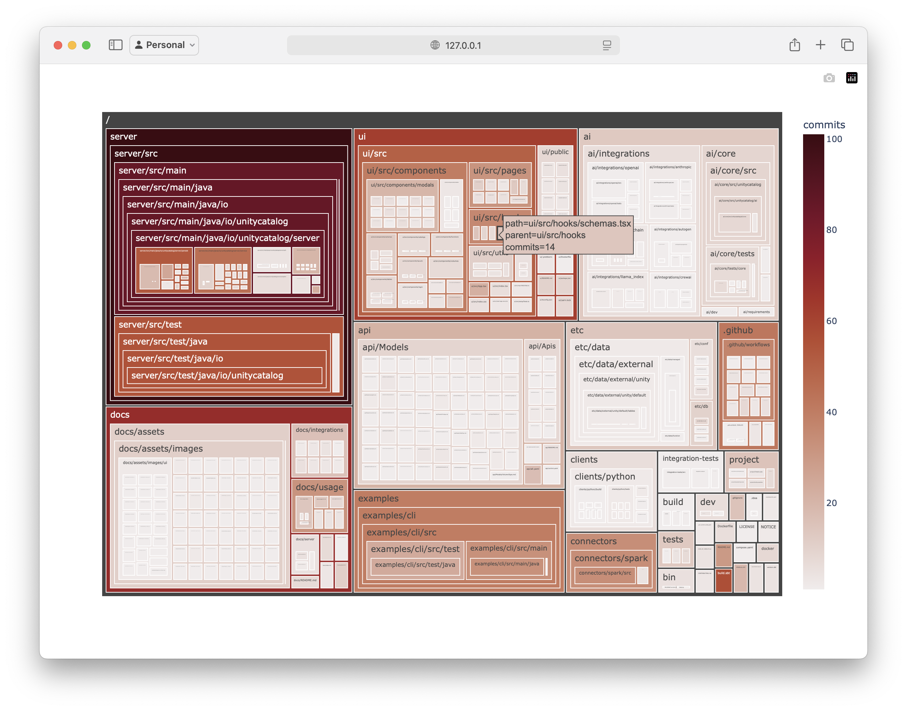

# A simple way of visualizing git repository evolution.

Some time ago, a new colleague joined our department and started working on a platform our department provides. During his initial days, I noticed he was using an interactive Python shell to create [treemap](https://en.wikipedia.org/wiki/Treemapping) visualizations of the project's git history.

The visualizations looked something like this.

This immediately sparked my interest.
Normally, when starting to learn about a new codebase, I would also look at git history, but i would mainly focus on basic information like the number of commits, contributors, stars and so on. However, these visualizations offered a new interesting perspective on understanding how the repository evolved over time.

Creating these visualizations allowed the colleague to easily locate files that were most used in the project. And therefore had a higher probability that he would have to eventually touch them as well.

This caught my attention as it is really great way of getting additional perspective on the state of git project. It helps with seeing where the core issue of the project is being addressed, by showing which files are edited most, and contain the largest amount of collaborators. Based on these information its easier to find out which parts of the code are more interesting, and likely to be touched in the future, so it might make sense to learn a bit more about these frequently used files.

However i did not remember what the exact commands were.

Later I found out about [git-truck](https://github.com/git-truck/git-truck) from another colleague. It is a very simple and convenient tool. It is installed and executed by one simple command `npx -y git-truck`. It allows to use filters to highlight different information about the project.

When the back then new colleague was using his own make shift git-truck, i remember he used something to interact with git and something to render the filesystem as a [treemap](https://en.wikipedia.org/wiki/Treemapping). After a bit of searching i figured a great combination are [GitPython](https://gitpython.readthedocs.io/en/stable/quickstart.html#gitpython-quick-start-tutorial) and [Plotly](https://plotly.com/python/treemaps/).

GitPython allows to easily iterate over the git history, and also to create the tree of directories and files.

Plotly can be used to easily visualize this tree in browser. It allows for simple configuration based on which its easy to highlight different information about the project.

 It can also be used to provide other useful information, like how many different people used to collaborate on the specific files.

I especially appreciate the simplicity of these two libraries, and that its possible to quickly change them to render different interesting data.

For instance the size of tiles can depend on the sizes of files. Or we can also render the amount of collaborators on each specific file.

These couple of lines can be useful when analyzing small git repos, like for instance when each microservice is its own repo. However if you try to run it against something larger, like try to visualize the git history of [CPython](https://github.com/python/cpython), if will fail miserably.