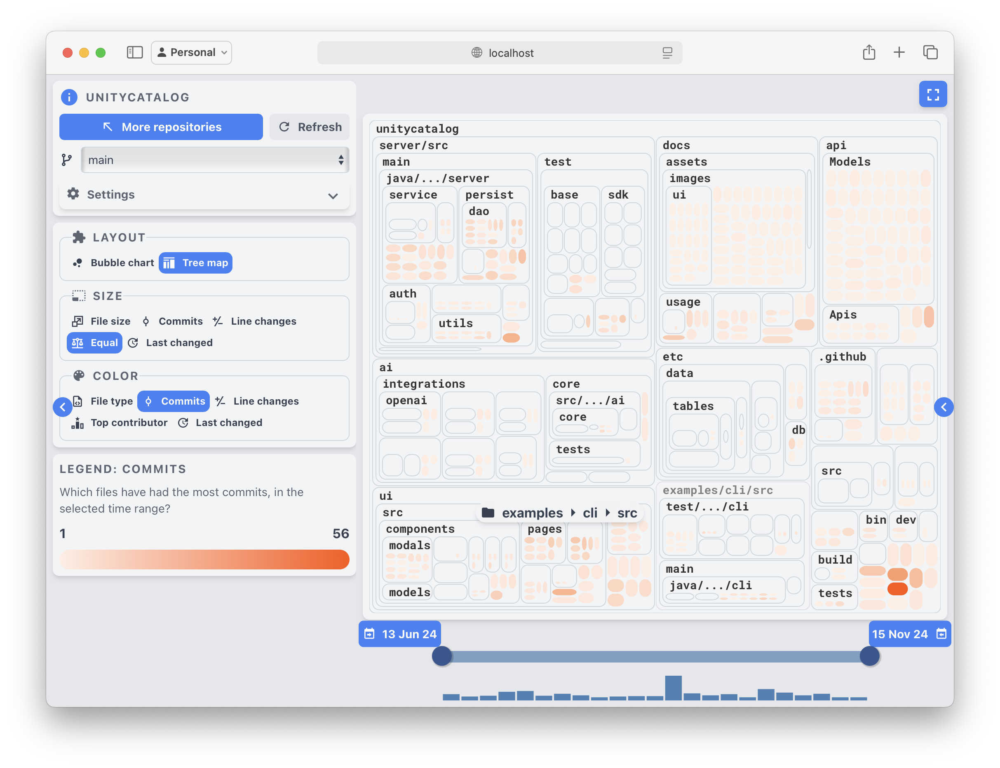
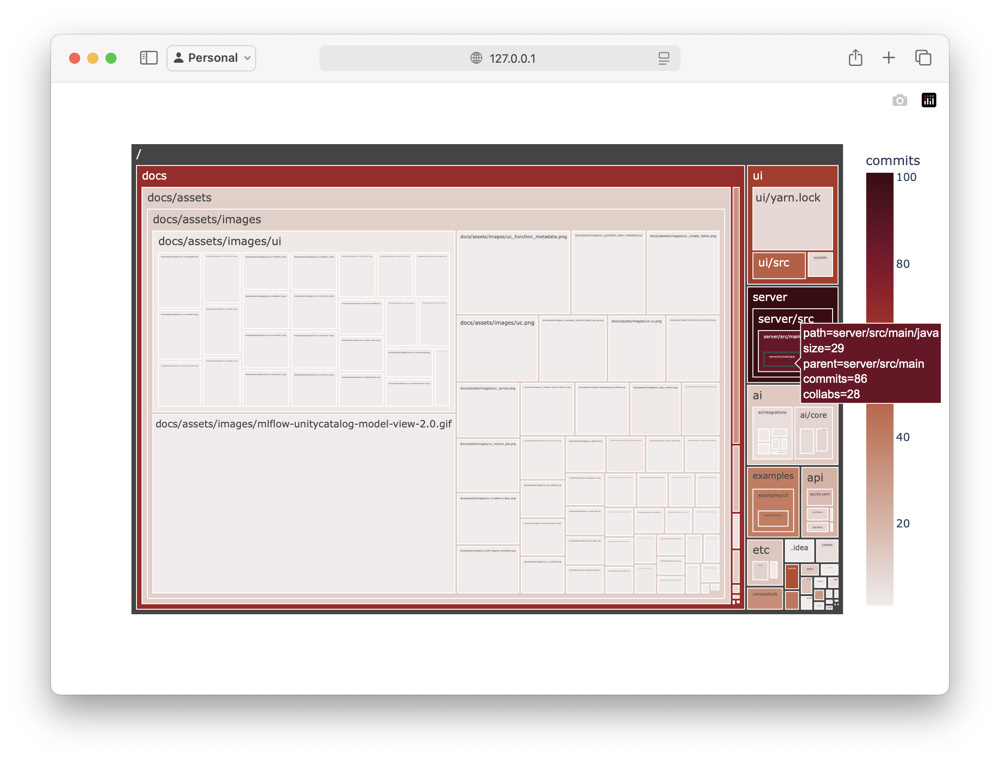

# A simple way of visualizing git repository evolution.

Some time ago, a new colleague joined our department and started working on a platform our department provides. During his initial days, I noticed he was using an interactive Python shell to create [treemap](https://en.wikipedia.org/wiki/Treemapping) visualizations of the project's git history.

### The visualizations looked something like this.

*Visualization of [Unity Catalog](https://github.com/unitycatalog/unitycatalog) repository using custom code snippet.*

This immediately sparked my interest.
Normally, when starting to learn about a new codebase, I would also look at git history, but i would mainly focus on basic information like the number of commits, contributors, stars and so on. However, these visualizations offered a new interesting perspective on understanding how the repository evolved over time.

### What does this help with?
Creating these visualizations helped the colleague to see where the core issue of the project is being addressed by showing which files are edited most, and contain the largest amount of collaborators. Based on these information its easier to find out which parts of the code are more interesting, and likely to be touched in the future. Therefore it might make sense to learn a bit more about these frequently used files before starting to work on the project.

I sadly did not remember the exact commands the colleague used.

### git-truck
Later I found out about [git-truck](https://github.com/git-truck/git-truck) from another colleague. It creates very similar visualizations and is overall a simple and convenient tool. It is installed and executed by one simple command `npx -y git-truck`. It allows to use filters to highlight different information about the project. The tool is private by design, free and open source. I am a big fan of it and use it fairly frequently.

Visualizations by `git-truck` look like this.

*Visualization of [Unity Catalog](https://github.com/unitycatalog/unitycatalog) repository using `git-truck`.*

### Homemade git-truck.
When the back then new colleague was using his own make shift `git-truck`, i remember he used something to interact with git and something to render the filesystem as a [treemap](https://en.wikipedia.org/wiki/Treemapping).

After a bit of searching i figured a great combination is [GitPython](https://gitpython.readthedocs.io/en/stable/quickstart.html#gitpython-quick-start-tutorial) combined with [Plotly](https://plotly.com/python/treemaps/).

These dependencies ccan by installed by executing the following command: `pip install GitPython plotly`.

GitPython is a simple library which allows for interaction with git repository directly from Python. Traversing through tree of files and directories or iterating through the git commit history can be easily done by using this library.

The following code snippet creates a list which contains some additional information about all files and directories.
```
import os
from git import Repo

repo = Repo("./unitycatalog")

blobs = [{
    'parent': os.path.dirname(blob.path) or "/",
    'path': blob.path,
    'commits': len(commits := list(repo.iter_commits(paths=blob.path))),
} for blob in repo.tree().traverse()]
```

Plotly can be used to create simple visualizations of this tree in a browser. It allows for easy configuration based on which its clear to highlight different information about the project.

The following code snippet renders the previously calculated list as a treemap. You already saw this visualization in the first part of [this page](#the-visualizations-looked-something-like-this).
```
import plotly.express as px

px.treemap(
    blobs,
    names='path',
    parents='parent',
    color='commits',
    color_continuous_scale='amp',
).show()
```

I especially like the simplicity of these two libraries, and that its possible to quickly change them to render different interesting data. I also like that the whole configuration is a simple Python.

For instance the size of tiles can depend on the sizes of files. Or we can also render the amount of collaborators on each specific file.

This can be achieved by editing the snippet into a following form.
```
import os
import plotly.express as px
from git import Repo

repo = Repo("./unitycatalog")

blobs = [{
    'parent': os.path.dirname(blob.path) or "/",
    'path': blob.path,
    'size': blob.size,
    'commits': len(commits := list(repo.iter_commits(paths=blob.path))),
    'collabs': len(set(c.author.email for c in commits))
} for blob in repo.tree().traverse()]

px.treemap(
    blobs,
    names='path',
    parents='parent',
    values='size',
    hover_data=['commits', 'collabs'],
    color='commits',
    color_continuous_scale='amp',
).show()
```


*Visualization of [Unity Catalog](https://github.com/unitycatalog/unitycatalog) repository using custom code snippet with additional information.*

### Performance Considerations
These couple of lines can be useful when analyzing small git repos. However if you try to run this code snippet against a larger code base, like trying visualize the git history of [CPython](https://github.com/python/cpython), it will take a very long time. I don't know how long it would take as i canceled it after couple of minutes. Luckily `git-truck` loads even larger projects very quickly.